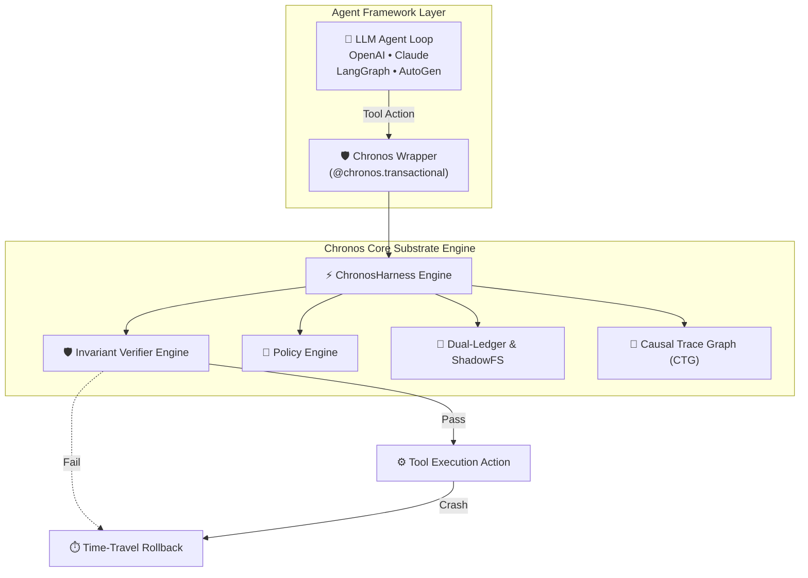

# Contributing to Chronos-Agent ⚡

Thank you for your interest in contributing to **Chronos-Agent**! Chronos is an open-source, framework-agnostic execution substrate that brings transactional snapshotting, live causal failure tracing, pre-flight assertion verification, and sub-second time-travel rollback to AI agents.

We welcome contributions from developers, researchers, and agentic framework creators.

---

## 🏗️ Architecture Overview

Before making changes, it helps to understand the core architecture:



### Core Subsystems
1. **`chronos/core.py` (`ChronosHarness`)**: Central thread-safe coordinator engine.
2. **`chronos/shadow_fs.py` (`ShadowFS`)**: Transactional incremental snapshotting with LRU eviction.
3. **`chronos/dual_ledger.py` (`DualLedger`)**: Synchronizes environment file state and prompt history.
4. **`chronos/verifier.py` (`InvariantVerifier`)**: Pre-flight AST syntax check and safety guards.
5. **`chronos/causal_graph.py` (`CausalTraceGraph`)**: Live causal execution DAG lineage.
6. **`chronos/policy.py` (`PolicyEngine`)**: Scope-locked RBAC permissions & path matching.
7. **`chronos/speculative.py` (`SpeculativeExecutor`)**: Multi-worker parallel branch execution.
8. **`chronos/jit_compiler.py` (`JITCompiler`)**: Skill compilation for zero-token execution.
9. **`chronos/persona.py` (`PersonaManager`)**: State freezing, forking, and diffing.
10. **`chronos/adapters/`**: Framework adapters (LangGraph, generic tool wrappers).

---

## 🛠️ Local Development Setup

### 1. Prerequisites
- Python 3.8+
- `git`

### 2. Fork & Clone
```bash
git clone https://github.com/umang-algo/chronos-agent.git
cd chronos-agent
```

### 3. Install in Editable Mode with Dev Dependencies
```bash
pip install -e .[dev]
```

### 4. Run Test Suite
```bash
# Run unit test suite (63 tests)
python3 -m unittest discover -s tests
```

---

## 🧪 How to Add Custom Invariants (`verifier.py`)

Invariants are pre-flight or post-flight assertion rules executed before or after a tool modifies the environment.

### Registering a Pre-Flight Rule
```python
from chronos import ChronosHarness

def check_sql_injection(payload: dict) -> tuple[bool, str, str | None]:
    query = payload.get("query", "")
    if "DROP TABLE" in query.upper():
        return False, "Pre-flight Blocked: DROP TABLE query forbidden.", "Use parameterized DELETE queries instead."
    return True, "Check passed.", None

harness = ChronosHarness(workspace_dir="./project")
harness.verifier.register_pre_flight_rule("sql_guard", check_sql_injection)
```

---

## 🔌 How to Build a New Framework Adapter

All adapters belong in `chronos/adapters/`. An adapter wraps framework node/tool functions with `ChronosHarness.execute_tool_transactional()`:

```python
import functools
from chronos import ChronosHarness

class MyFrameworkAdapter:
    def __init__(self, harness: ChronosHarness):
        self.harness = harness

    def wrap_tool(self, tool_name: str, tool_fn: callable):
        @functools.wraps(tool_fn)
        def wrapper(args: dict, prompt_stack: list):
            cp = self.harness.create_checkpoint(prompt_stack=prompt_stack)
            return self.harness.execute_tool_transactional(
                tool_name=tool_name,
                tool_args=args,
                tool_fn=tool_fn,
                prompt_stack=prompt_stack,
                current_checkpoint=cp
            )
        return wrapper
```

---

## 📐 Code Style & Pull Request Guidelines

1. **Thread Safety**: All stateful methods on `ChronosHarness` must remain thread-safe using `self._lock = threading.RLock()`.
2. **Zero Memory Leaks**: Ensure temporary files or snapshots are cleaned up or evicted via `ShadowFS.max_snapshots` / `PersonaManager.cleanup_fork()`.
3. **100% Test Pass Guarantee**: All pull requests must pass the complete unit test suite without regressions.
4. **Clean PR Description**: Describe the problem solved, architectural impact, and include updated test commands.

---

## 📜 License

By contributing to Chronos-Agent, you agree that your contributions will be licensed under the MIT License.
