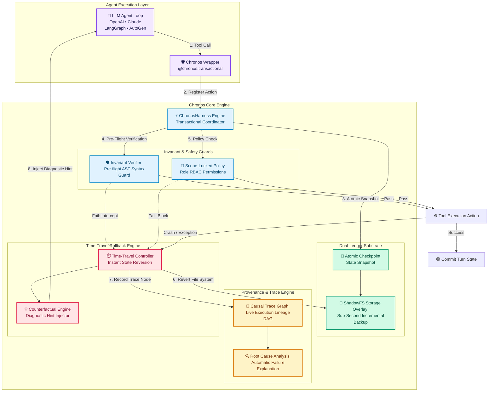

# Chronos-Agent ⚡
### The Transactional Intelligence Substrate & Time-Travel Harness for AI Agents

[](https://opensource.org/licenses/MIT)
[](https://www.python.org/)
[](tests/)

**What Chronos Does**: Chronos acts as a transactional safety harness for AI agents. When an agent tool call corrupts a file, writes invalid syntax, or crashes, **Chronos automatically undoes the environment damage** and rewinds your workspace files back to the clean state before the turn.

> **Why Existing Frameworks Fail & How Chronos Fixes It**: Today's agent frameworks (LangGraph, AutoGen, CrewAI, OpenAI SDK) save conversation text, but **they leave corrupted files and bad database changes on disk when an action fails**. When an agent breaks a file at Step 5, it gets trapped trying to fix broken code on top of corrupted ground. **Chronos fixes this by keeping environment state and prompt history in lockstep**: if an action fails pre-flight rules or crashes, Chronos automatically rewinds your files to the previous checkpoint, injects a diagnostic hint into the prompt, and lets the AI resume reasoning from 100% clean ground.

---

## 🌟 Feature Comparison

| Capability | LangGraph | AutoGen | CrewAI | **Chronos-Agent** |
|:---|:---:|:---:|:---:|:---:|
| **Environment Filesystem Snapshotting** | ❌ | ❌ | ❌ | ✅ **Sub-Second** |
| **Time-Travel Substrate Rollback** | ❌ | ❌ | ❌ | ✅ **Sub-Second** |
| **Pre-Flight Invariant Assertion Guards** | ❌ | ❌ | ❌ | ✅ **AST & Rules** |
| **Live Causal Execution Trace Graph (CTG)** | ❌ | ❌ | ❌ | ✅ **Live Lineage** |
| **Scope-Locked Policy Engine (RBAC)** | ❌ | ❌ | ❌ | ✅ **Role-Based** |
| **Speculative Parallel Branch Execution** | ❌ | ❌ | ❌ | ✅ **Multi-Worker** |
| **JIT Skill Trajectory Compilation** | ❌ | ❌ | ❌ | ✅ **Zero-Token** |
| **Persona State Freeze, Fork & Diff** | ❌ | ❌ | ❌ | ✅ **Portable State** |
| **Counterfactual Diagnostic Injection** | ❌ | ❌ | ❌ | ✅ **Automatic** |
| **Framework-Agnostic Middleware** | — | — | — | ✅ **Universal** |

---

## 🏗️ System Architecture



---

## 🧬 Live Causal Trace Graph (CTG)

Chronos builds a **live causal DAG** mapping turn lineage (`Checkpoint ➔ Tool Call ➔ Invariant Check ➔ Failure ➔ Rollback ➔ Counterfactual Hint`).

When a turn fails, call:
```python
explanation = harness.causal_graph.explain_failure(failure_node_id)
print(explanation)
```

Output:
```text
Root cause at Step 1: [CHECKPOINT] 'cp_step_1'
→ which caused Step 1: [TOOL_CALL] 'tool:process_refund'
→ which caused Step 1: [INVARIANT_CHECK] 'invariant:financial_invariant_guard'
→ which ultimately caused Step 1: [FAILURE] 'Pre-flight assertion failed'
💡 Fix: Refund cap exceeded: Maximum refundable amount for Order #1050 is $170.00.
```

---

## 🚀 Quickstart

### Installation
```bash
git clone https://github.com/umang-algo/chronos-agent.git
cd chronos-agent
pip install -e .
```

### Wrapping Any Tool Function (OpenAI / Claude / Any Agent)

```python
from chronos import ChronosHarness, ChronosAgentWrapper

harness = ChronosHarness(workspace_dir="./my_project")
wrapper = ChronosAgentWrapper(harness)

def write_file(args):
    with open(args["path"], "w") as f:
        f.write(args["content"])

safe_write = wrapper.wrap_tool("write_file", write_file)

prompt_stack = [{"role": "user", "content": "Refactor code"}]
result = safe_write({"path": "app.py", "content": "def main(): pass"}, prompt_stack)

if not result["success"]:
    # Workspace automatically reverted sub-second!
    print(f"Rollback triggered: {result['hint']}")
```

---

## 💻 Web Dashboard UI & Terminal CLI

```bash
# Launch 4-Tab Interactive Web Dashboard UI (http://localhost:8080)
python3 examples/chronos_visual_dashboard/server.py 8080

# Launch Interactive Terminal CLI Tester
python3 examples/interactive_agent_cli.py
```

---

## 🤝 Contributing

We welcome open-source contributions! Please review our [CONTRIBUTING.md](CONTRIBUTING.md) for guidelines on adding invariant rules, building framework adapters, and submitting pull requests.

---

## 📜 License

MIT License. Built for the future of reliable, deterministic, and traceable AI Agent execution.
